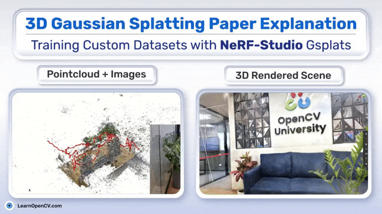
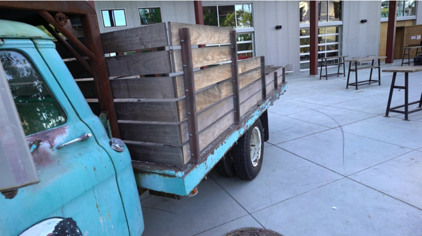
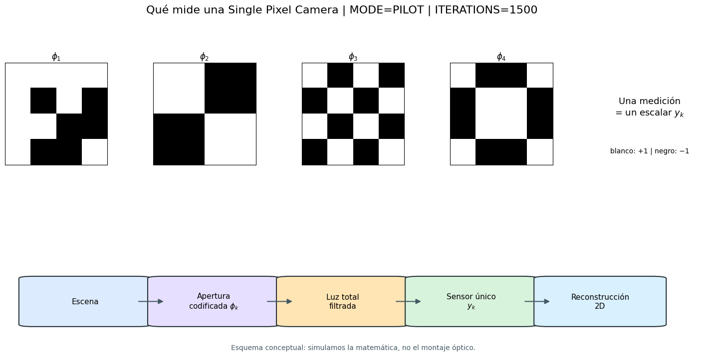
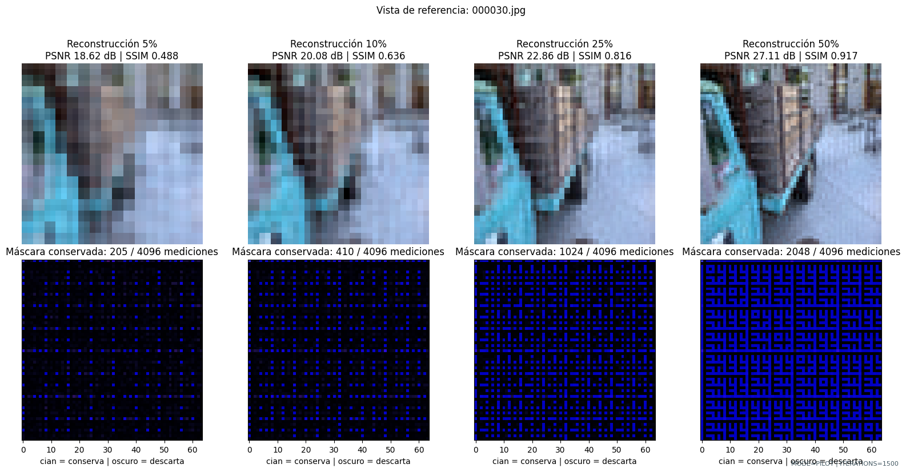
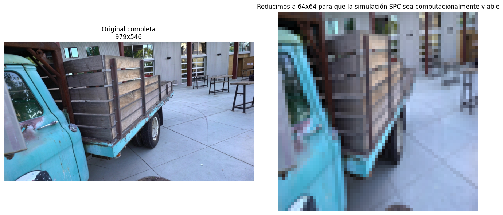
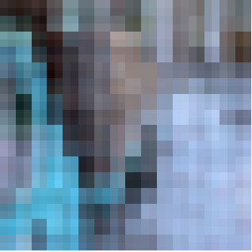
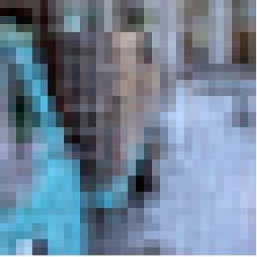
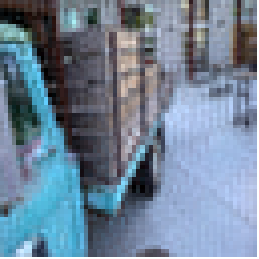
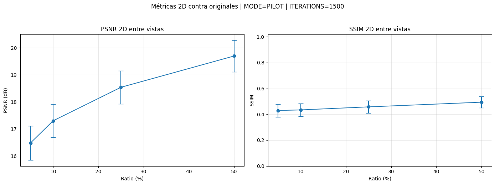
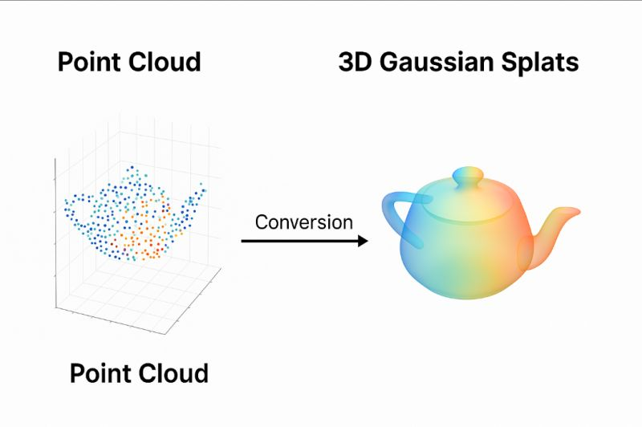

## Estado de avance

:::: {.title-hero}
::: {.title-text}
::: {.eyebrow}
PROYECTO INF449 · OCTUBRE 2026
:::

### Comprimir la captura.<br>Reconstruir la escena.

**Single Pixel Camera + Gaussian Splatting**

Francisco Alfaro · Ayrton Perez
:::

```{=html}
<figure class="title-visual">
  <div class="gif-box"></div>
  <figcaption class="fig-caption">Render ilustrativo con 3DGS. <span class="fig-source">Fuente: LearnOpenCV, «3D Gaussian Splatting Paper Explanation» (learnopencv.com).</span></figcaption>
</figure>
```
::::

::: {.notes}
La pregunta del proyecto es simple: cuánto podemos reducir la información de las vistas sin perder una representación 3D útil. El flujo combina una simulación SPC basada en Hadamard con Gaussian Splatting.
:::

## 1. Problema general

:::: {.columns .problem-slide}
::: {.column width="42%"}

::: {.eyebrow}
MOTIVACIÓN
:::

### Menos mediciones,<br>misma escena

Una reconstrucción 3D multivista necesita muchas imágenes y sus poses. En este proyecto simulamos una **Single Pixel Camera (SPC)** para medir qué ocurre cuando solo conservamos una fracción de la información.

::: {.accent-card}
**Pregunta central**

¿Cuánto se puede comprimir una vista y todavía obtener un modelo 3D útil?
:::

<div class="tag-row"><span>Escena objetivo: <code>truck</code> [4]</span><span>251 vistas</span><span>poses COLMAP</span></div>
:::

::: {.column width="58%"}
::: {.image-frame .hero-frame}
{fig-alt="Vista de referencia de la escena truck"}
<div class="image-caption">Vista de referencia de <code>truck</code>, la misma que sigue el notebook a través del pipeline. <span class="fig-source">Fuente: dataset Tanks and Temples [4], exportación propia.</span></div>
:::
:::
::::

## 2. ¿Qué es una SPC?

:::: {.columns}
::: {.column width="56%"}

::: {.eyebrow}
MODELO DIRECTO
:::

```{mermaid}
flowchart LR
  A[Escena / imagen RGB] --> B[Patrón Hadamard]
  B --> C[Medición escalar]
  C --> D[Vector de mediciones y]
  D --> E[Reconstrucción x-hat]
  E --> F[Entrada a 3DGS]
```

La cámara no registra cada píxel por separado: proyecta la escena sobre patrones y conserva las mediciones resultantes [1].
:::

::: {.column width="44%"}
::: {.image-frame .spc-frame .notebook-wide-frame}
{fig-alt="Patrones Hadamard y flujo de medición de una Single Pixel Camera"}
<div class="image-caption">Salida de <code>codes/notebook.ipynb</code>: patrones, medición escalar y reconstrucción 2D. Es una simulación matemática, no un montaje óptico físico. <span class="fig-source">Fuente: elaboración propia.</span></div>
:::

::: {.equation-card}
$$y_k = \langle h_k, x\rangle$$

Cada medición es un producto interno entre la imagen $x$ y un patrón $h_k$.
:::
:::
::::

## 3. Hadamard y reconstrucción

:::: {.columns}
::: {.column width="50%"}
::: {.image-frame .hadamard-frame}
{fig-alt="Reconstrucciones Hadamard al 5, 10, 25 y 50 por ciento"}
<div class="image-caption">Resultado preliminar en una vista: al aumentar el ratio, mejoran PSNR y SSIM. <span class="fig-source">Fuente: elaboración propia, notebook.</span></div>
:::
:::

::: {.column width="50%"}
::: {.eyebrow}
TRANSFORMADA ORTOGONAL
:::

### Medir en una base estructurada

Los patrones de Hadamard son binarios y ortogonales. Con ellos podemos controlar directamente cuántos coeficientes conservar.

::: {.equation-card}
$$y = S\,H\,x \qquad\qquad \hat{x} = H^{\mathsf T} S^{\mathsf T} y$$

- $H$: base Hadamard normalizada, $H^{\mathsf T}H = I$.
- $S \in \{0,1\}^{m\times n}$ conserva $m = r\,n$ coeficientes; $S^{\mathsf T}$ pone en cero los descartados.
- Se conservan los de **menor secuencia** (menos cambios de signo en filas + columnas): las componentes de baja frecuencia.
:::

::: {.image-frame .small-inset-frame}
{fig-alt="Comparación entre la vista original y la resolución de trabajo 64 por 64"}
<div class="image-caption">La simulación trabaja a <code>64 × 64</code> y luego reescala para conservar la resolución compatible con las poses. <span class="fig-source">Fuente: elaboración propia, notebook.</span></div>
:::
:::
::::

## 4. Comparación SPC

::: {.eyebrow}
PILOTO 2D · 30 VISTAS
:::

### De la imagen completa a una fracción de mediciones

El piloto 2D ya permite mostrar una vista de cada ratio. Los valores de abajo son el promedio sobre **30 vistas**; todavía no son métricas de la escena 3D.

<!-- La tabla muestra el piloto 2D; las métricas 3D se completan después de OE4. -->
```{=html}
<div class="condition-strip">
  <figure class="condition-card condition-base">
    <div class="condition-image slot"></div>
    <figcaption><strong>Original</strong><span>referencia RGB</span><span class="metric-caption">sin compresión</span></figcaption>
  </figure>
  <figure class="condition-card">
    <div class="condition-image slot"></div>
    <figcaption><strong>SPC 5 %</strong><span>30 vistas</span><span class="metric-caption">16,48 dB · 0,429</span></figcaption>
  </figure>
  <figure class="condition-card">
    <div class="condition-image slot"></div>
    <figcaption><strong>SPC 10 %</strong><span>30 vistas</span><span class="metric-caption">17,30 dB · 0,434</span></figcaption>
  </figure>
  <figure class="condition-card">
    <div class="condition-image slot"></div>
    <figcaption><strong>SPC 25 %</strong><span>30 vistas</span><span class="metric-caption">18,54 dB · 0,457</span></figcaption>
  </figure>
  <figure class="condition-card">
    <div class="condition-image slot"></div>
    <figcaption><strong>SPC 50 %</strong><span>30 vistas</span><span class="metric-caption">19,70 dB · 0,494</span></figcaption>
  </figure>
</div>
```

:::: {.columns .comparison-bottom}
::: {.column width="36%"}
::: {.image-frame .comparison-reference-frame}
{.comparison-reference fig-alt="PSNR y SSIM 2D promedio en 30 vistas"}
<div class="image-caption">Promedios y desviación estándar sobre 30 vistas. <span class="fig-source">Fuente: elaboración propia, notebook.</span></div>
:::
:::
::: {.column width="64%"}
| Condición | Mediciones | Estado |
|:--|--:|:--|
| Baseline | 100 % | entrada original |
| SPC 5 / 10 / 25 / 50 % | ratio controlado | 30 vistas procesadas |

::: {.callout-note}
La tira ya documenta el piloto 2D. Falta repetir el recorrido completo en 3DGS y comparar los renders contra la referencia original.
:::
:::
::::

## 5. Gaussian Splatting

:::: {.columns}
::: {.column width="43%"}
::: {.eyebrow}
REPRESENTACIÓN 3D
:::

### De puntos a gaussianas

Cada primitiva se describe por su posición, forma, orientación, opacidad y color [2]:

::::: {.parameter-grid}
::: {.param}
[μ]{.param-symbol} [posición]{.param-label}
:::
::: {.param}
[Σ]{.param-symbol} [covarianza]{.param-label}
:::
::: {.param}
[α]{.param-symbol} [opacidad]{.param-label}
:::
::: {.param}
[c]{.param-symbol} [color]{.param-label}
:::
:::::

::: {.gauss-eq}
$$G(x)=\exp\left(-\frac{1}{2}(x-\mu)^T\Sigma^{-1}(x-\mu)\right)$$
:::
:::

::: {.column width="57%"}
::: {.image-frame .gaussian-frame}
{fig-alt="Conversión conceptual de nube de puntos a Gaussian Splatting"}
<div class="image-caption">De nube de puntos a gaussianas 3D (esquema conceptual). <span class="source-pending">Verificar origen/licencia antes de presentar.</span></div>
:::

::: {.equation-card}
$$C(p)=\sum_i T_i\,\alpha_i\,c_i, \qquad T_i=\prod_{j<i}(1-\alpha_j)$$
:::
:::
::::

## 6. COLMAP

::: {.eyebrow}
GEOMETRÍA MULTIVISTA
:::

### Cámaras + nube de puntos

:::: {.columns .colmap-slide}
::: {.column width="45%"}
```{=html}
<div class="diagram-panel">
  <div class="camera-orbit">
    <span class="point-cloud">⋯ ⋅ ⋅ ⋅ ⋅ ⋅ ⋅ ⋯</span>
    <span class="point-cloud-label">nube de puntos</span>
    <span class="camera camera-a">CAM 01</span>
    <span class="camera camera-b">CAM 02</span>
    <span class="camera camera-c">CAM 03</span>
    <span class="scene-object">truck</span>
  </div>
  <div class="panel-label">Poses estimadas y triangulación (esquema)</div>
</div>
```
:::
::: {.column width="55%"}
```{=html}
<figure class="image-frame colmap-figure">
  
  <figcaption class="fig-caption">La vista real pertenece a <code>truck</code>; sus poses se conservan desde COLMAP para todas las condiciones. <span class="fig-source">Fuente: dataset [4], exportación propia.</span></figcaption>
</figure>
```
:::
::::

::: {.callout-note}
La preparación del proyecto conserva la correspondencia entre cada nombre de imagen y su pose en <code>images.bin</code>.
:::

## 7. Render 3DGS

:::: {.columns}
::: {.column width="62%"}
::: {.image-frame .gif-frame}
{fig-alt="Animación del paso desde una nube de puntos a una escena renderizada"}
<div class="image-caption">De la nube de puntos a la escena renderizada. <span class="fig-source">Fuente: LearnOpenCV, «3D Gaussian Splatting Paper Explanation» (learnopencv.com).</span></div>
:::
:::
::: {.column width="38%"}
::: {.eyebrow}
OPTIMIZACIÓN
:::

### Original frente a render

El modelo ajusta las gaussianas para que el render desde cada cámara reproduzca las vistas observadas [2].

::: {.equation-card}
$$L=(1-\lambda)\,L_1+\lambda\,L_{\text{D-SSIM}}, \qquad \lambda = 0{,}2$$
:::

::: {.metric-row}
<span class="metric">3D pendiente</span><span class="metric-label">faltan train, render y metrics válidos</span>
:::

La comparación definitiva será entre el baseline y los cuatro ratios SPC. El notebook todavía no tiene renders 3DGS válidos para mostrar.
:::
::::

## 8. Baseline frente a SPC

::: {.eyebrow}
DISEÑO DE LA COMPARACIÓN
:::

### Misma escena, distinta información

:::: {.columns .three-way}
::: {.column}
::: {.step-card .step-neutral}
<span class="step-number">01</span>

### Baseline

Imágenes RGB originales, poses COLMAP y entrenamiento 3DGS.
:::
:::
::: {.column}
::: {.step-card .step-accent}
<span class="step-number">02</span>

### SPC

Mediciones Hadamard → reconstrucción de cada vista → mismas poses → 3DGS.
:::
:::
::: {.column}
::: {.step-card .step-orange}
<span class="step-number">03</span>

### Evaluación

PSNR, L1, tiempos de entrenamiento y calidad visual del render.
:::
:::
::::

::: {.callout-large}
**Lectura:** si la calidad 3D cae poco al reducir las mediciones, la SPC funciona como una compresión útil para el pipeline multivista.
:::

## 9. Métricas

::: {.eyebrow}
QUÉ VAMOS A MEDIR
:::

### Calidad de entrada y calidad 3D

:::: {.columns .metrics-slide}
::: {.column width="60%"}
```{=html}
<div class="chart-grid">
  <figure class="chart-figure image-frame chart-wide">
    
    <figcaption class="fig-caption">Resultado disponible: métricas 2D promedio sobre 30 vistas. <span class="fig-source">Fuente: elaboración propia, notebook.</span></figcaption>
  </figure>
</div>
<p class="metric-legend"><b>PSNR</b>: fidelidad de imagen · <b>L1</b>: error absoluto · <b>SSIM</b> [5]: estructura perceptual · <b>Tiempo</b>: costo computacional</p>
```
:::
::: {.column width="40%"}
```{=html}
<table>
  <thead><tr><th>Condición</th><th>PSNR (dB)</th><th>SSIM</th><th>L1</th><th>Tiempo</th></tr></thead>
  <tbody>
    <tr><td>Baseline</td><td>—</td><td>—</td><td>—</td><td>—</td></tr>
    <tr><td>SPC 5 %</td><td>16,48</td><td>0,429</td><td>—</td><td>2D</td></tr>
    <tr><td>SPC 10 %</td><td>17,30</td><td>0,434</td><td>—</td><td>2D</td></tr>
    <tr><td>SPC 25 %</td><td>18,54</td><td>0,457</td><td>—</td><td>2D</td></tr>
    <tr><td>SPC 50 %</td><td>19,70</td><td>0,494</td><td>—</td><td>2D</td></tr>
  </tbody>
</table>
```

::: {.callout-note}
**Lectura:** el piloto 2D mejora de forma monotónica con más mediciones. La tabla 3D (PSNR/SSIM/LPIPS y tiempos) sigue pendiente porque OE4 no generó renders evaluables.
:::
:::
::::

## 10. Estado del proyecto

::: {.eyebrow}
AVANCE A LA FECHA
:::

::::: {.status-grid}
:::: {.status-card .status-done}
[✓ Hecho]{.status-title}

- Simulación SPC con patrones Hadamard implementada en notebook.
- Pipeline 2D reproducible y 30 vistas procesadas.
- Correspondencia imagen ↔ pose en <code>images.bin</code>.
- Resolución de trabajo <code>64 × 64</code> y reescalado compatible con las poses.
::::

:::: {.status-card .status-progress}
[◐ En curso]{.status-title}

- Preparar el repositorio 3DGS en la VM (la inicialización falló en la última corrida).
- Repetir el piloto 3D con baseline y `spc_025`.
::::

:::: {.status-card .status-pending}
[○ Pendiente]{.status-title}

- Ejecutar `train.py`, `render.py` y `metrics.py` para baseline y ratios SPC.
- Validar `test/ours_<iter>/{renders,gt}`, `results.json` y logs.
- Recién después, completar PSNR, SSIM, LPIPS y tiempos 3D.
- Insertar renders, gráficos 3D y análisis final.
::::
:::::

## 11. Próximos pasos

:::: {.columns}
::: {.column width="58%"}
::: {.eyebrow}
PLAN DE CIERRE
:::

### Del piloto a la comparación final

1. Reparar la inicialización del repositorio 3DGS y confirmar que `train.py` arranca.
2. Repetir primero el piloto con baseline y `spc_025`; no pasar a `FULL` sin aprobarlo.
3. Ejecutar baseline, 5 %, 10 %, 25 % y 50 % con la misma configuración.
4. Consolidar renders, PSNR, SSIM, LPIPS y tiempos en una tabla única.
5. Insertar resultados 3D y analizar el punto de equilibrio entre compresión y calidad.
:::

::: {.column width="42%"}
::: {.link-panel}

<br>

<div class="link-heading">Código, notebooks y referencias</div>

- [Código y notebooks · repositorio Github](https://github.com/fralfaro/inf449-proyecto/)
- [Página oficial de 3D Gaussian Splatting](https://repo-sam.inria.fr/fungraph/3d-gaussian-splatting/)
- [Repositorio oficial en GitHub](https://github.com/graphdeco-inria/gaussian-splatting)
- [Paper de 3D Gaussian Splatting](https://repo-sam.inria.fr/fungraph/3d-gaussian-splatting/3d_gaussian_splatting_high.pdf)

::: {.accent-card}
**Hito actual**

El piloto 2D está documentado; la comparación 3D aún no es válida porque faltan renders y métricas evaluables.
:::
:::
:::
::::

::: {.closing-line}
**Objetivo:** medir cuánto podemos comprimir sin perder la escena.
:::

## Referencias

<br><br>

::: {.references}
**[1]** M. F. Duarte, M. A. Davenport, D. Takhar, J. N. Laska, T. Sun, K. F. Kelly y R. G. Baraniuk. *Single-pixel imaging via compressive sampling.* IEEE Signal Processing Magazine, 25(2), 2008. [doi:10.1109/MSP.2007.914730](https://doi.org/10.1109/MSP.2007.914730)

**[2]** B. Kerbl, G. Kopanas, T. Leimkühler y G. Drettakis. *3D Gaussian Splatting for Real-Time Radiance Field Rendering.* ACM Transactions on Graphics, 42(4), 2023. [doi:10.1145/3592433](https://doi.org/10.1145/3592433)

**[3]** J. L. Schönberger y J.-M. Frahm. *Structure-from-Motion Revisited.* CVPR, 2016. [doi:10.1109/CVPR.2016.445](https://doi.org/10.1109/CVPR.2016.445)

**[4]** A. Knapitsch, J. Park, Q.-Y. Zhou y V. Koltun. *Tanks and Temples: Benchmarking Large-Scale Scene Reconstruction.* ACM Transactions on Graphics, 36(4), 2017. [doi:10.1145/3072959.3073599](https://doi.org/10.1145/3072959.3073599)

**[5]** Z. Wang, A. C. Bovik, H. R. Sheikh y E. P. Simoncelli. *Image Quality Assessment: From Error Visibility to Structural Similarity.* IEEE Transactions on Image Processing, 13(4), 2004. [doi:10.1109/TIP.2003.819861](https://doi.org/10.1109/TIP.2003.819861)

:::
