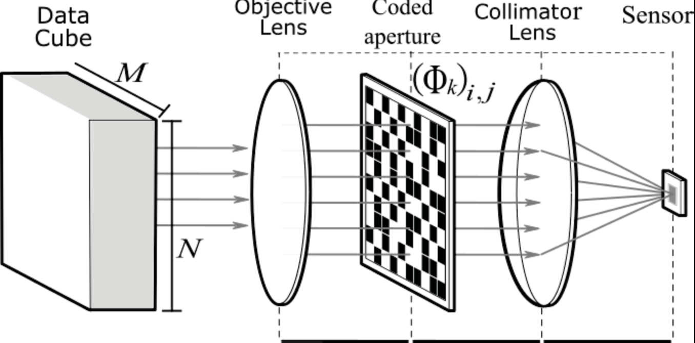
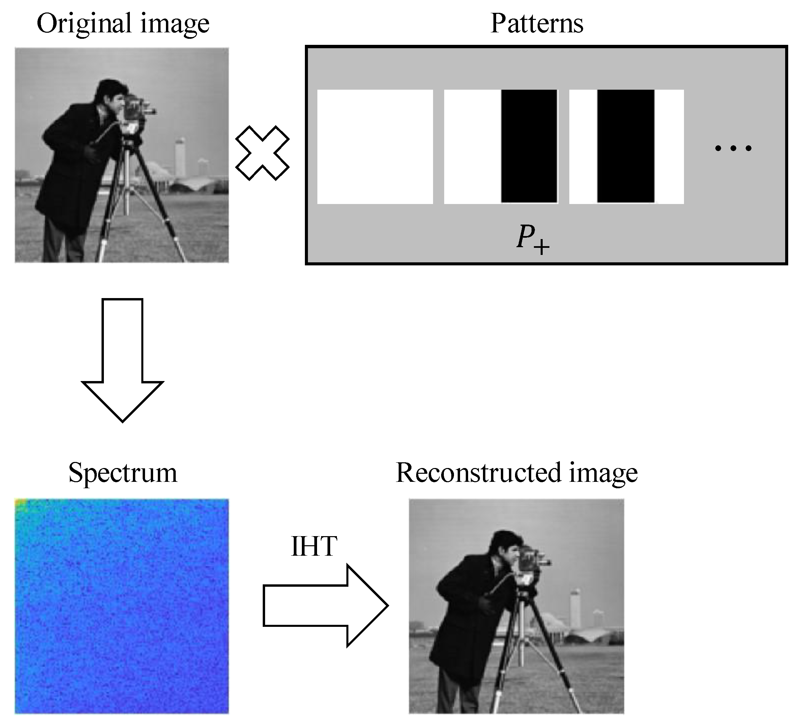
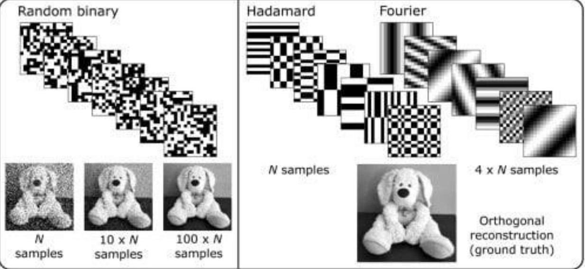

## Estado de avance

:::: {.title-hero}
::: {.title-text}
::: {.eyebrow}
PROYECTO INF449 · OCTUBRE 2026
:::

### Comprimir la captura.<br>Reconstruir la escena.

**Single Pixel Camera + Gaussian Splatting**

Francisco Alfaro · Ayrton Perez
:::

```{=html}
<figure class="title-visual">
  <div class="gif-box"></div>
  <figcaption class="fig-caption">Render ilustrativo con 3DGS. <span class="fig-source">Fuente: LearnOpenCV, «3D Gaussian Splatting Paper Explanation» (learnopencv.com).</span></figcaption>
</figure>
```
::::

::: {.notes}
La pregunta del proyecto es simple: cuánto podemos reducir la información de las vistas sin perder una representación 3D útil. El flujo combina una simulación SPC basada en Hadamard con Gaussian Splatting.
:::

## 1. Problema general

:::: {.columns .problem-slide}
::: {.column width="42%"}

::: {.eyebrow}
MOTIVACIÓN
:::

### Menos mediciones,<br>misma escena

Una reconstrucción 3D multivista necesita muchas imágenes y sus poses. En este proyecto simulamos una **Single Pixel Camera (SPC)** para medir qué ocurre cuando solo conservamos una fracción de la información.

::: {.accent-card}
**Pregunta central**

¿Cuánto se puede comprimir una vista y todavía obtener un modelo 3D útil?
:::

<div class="tag-row"><span>Escena objetivo: <code>truck</code> [4]</span><span>251 vistas</span><span>poses COLMAP</span></div>
:::

::: {.column width="58%"}
::: {.image-frame .hero-frame}
{fig-alt="Render animado de una escena 3D"}
<div class="image-caption">Recurso visual disponible: ejemplo de captura y render 3DGS. La fotografía final de <code>truck</code> se incorporará junto con los renders del piloto. <span class="fig-source">Fuente: LearnOpenCV, «3D Gaussian Splatting Paper Explanation» (learnopencv.com).</span></div>
:::
:::
::::

## 2. ¿Qué es una SPC?

:::: {.columns}
::: {.column width="56%"}

::: {.eyebrow}
MODELO DIRECTO
:::

```{mermaid}
flowchart LR
  A[Escena / imagen RGB] --> B[Patrón Hadamard]
  B --> C[Medición escalar]
  C --> D[Vector de mediciones y]
  D --> E[Reconstrucción x-hat]
  E --> F[Entrada a 3DGS]
```

La cámara no registra cada píxel por separado: proyecta la escena sobre patrones y conserva las mediciones resultantes [1].
:::

::: {.column width="44%"}
::: {.image-frame .spc-frame}
{fig-alt="Diagrama óptico de una Single Pixel Camera"}
<div class="image-caption">Esquema óptico con apertura codificada y sensor de un píxel. <span class="source-pending">Fuente: por confirmar</span></div>
:::

::: {.equation-card}
$$y_k = \langle h_k, x\rangle$$

Cada medición es un producto interno entre la imagen $x$ y un patrón $h_k$.
:::
:::
::::

## 3. Hadamard y reconstrucción

:::: {.columns}
::: {.column width="50%"}
::: {.image-frame .hadamard-frame}
{fig-alt="Patrones de Hadamard y reconstrucción de una imagen"}
<div class="image-caption">Medición con patrones Hadamard y reconstrucción por transformada inversa (IHT). <span class="source-pending">Fuente: por confirmar</span></div>
:::
:::

::: {.column width="50%"}
::: {.eyebrow}
TRANSFORMADA ORTOGONAL
:::

### Medir en una base estructurada

Los patrones de Hadamard son binarios y ortogonales. Con ellos podemos controlar directamente cuántos coeficientes conservar.

::: {.equation-card}
$$y = S\,H\,x \qquad\qquad \hat{x} = H^{\mathsf T} S^{\mathsf T} y$$

- $H$: base Hadamard normalizada, $H^{\mathsf T}H = I$.
- $S \in \{0,1\}^{m\times n}$ conserva $m = r\,n$ coeficientes; $S^{\mathsf T}$ pone en cero los descartados.
- Se conservan los de **menor secuencia** (menos cambios de signo en filas + columnas): las componentes de baja frecuencia.
:::

::: {.image-frame .small-inset-frame}
{fig-alt="Comparación entre patrones binarios, Hadamard y Fourier"}
<div class="image-caption">Patrones aleatorios, Hadamard y Fourier. <span class="source-pending">Fuente: por confirmar</span></div>
:::
:::
::::

## 4. Comparación SPC

::: {.eyebrow}
CONDICIONES DEL EXPERIMENTO
:::

### De la imagen completa a una fracción de mediciones

<!-- Reemplazar «—» por los valores de PSNR/SSIM al exportar las imágenes. -->
```{=html}
<div class="condition-strip">
  <figure class="condition-card condition-base">
    <div class="condition-image slot" data-label="BASE"></div>
    <figcaption><strong>Original</strong><span>100 % de la vista</span><span class="metric-caption">referencia</span></figcaption>
  </figure>
  <figure class="condition-card">
    <div class="condition-image slot" data-label="SPC 05"></div>
    <figcaption><strong>SPC 5 %</strong><span>piloto pendiente</span><span class="metric-caption">PSNR — dB · SSIM —</span></figcaption>
  </figure>
  <figure class="condition-card">
    <div class="condition-image slot" data-label="SPC 10"></div>
    <figcaption><strong>SPC 10 %</strong><span>piloto pendiente</span><span class="metric-caption">PSNR — dB · SSIM —</span></figcaption>
  </figure>
  <figure class="condition-card">
    <div class="condition-image slot" data-label="SPC 25"></div>
    <figcaption><strong>SPC 25 %</strong><span>condición central</span><span class="metric-caption">PSNR — dB · SSIM —</span></figcaption>
  </figure>
  <figure class="condition-card">
    <div class="condition-image slot" data-label="SPC 50"></div>
    <figcaption><strong>SPC 50 %</strong><span>piloto pendiente</span><span class="metric-caption">PSNR — dB · SSIM —</span></figcaption>
  </figure>
</div>
```

:::: {.columns .comparison-bottom}
::: {.column width="36%"}
::: {.image-frame .comparison-reference-frame}
{.comparison-reference fig-alt="Referencia visual del proceso de medición y reconstrucción"}
<div class="image-caption">Proceso de medición y reconstrucción. <span class="source-pending">Fuente: por confirmar</span></div>
:::
:::
::: {.column width="64%"}
| Condición | Mediciones | Estado |
|:--|--:|:--|
| Baseline | 100 % | entrada original |
| SPC 5 / 10 / 25 / 50 % | ratio controlado | por ejecutar |

::: {.callout-note}
La tira representa el diseño experimental. Las cinco imágenes finales y sus métricas se exportarán desde los notebooks al terminar el piloto.
:::
:::
::::

## 5. Gaussian Splatting

:::: {.columns}
::: {.column width="43%"}
::: {.eyebrow}
REPRESENTACIÓN 3D
:::

### De puntos a gaussianas

Cada primitiva se describe por su posición, forma, orientación, opacidad y color [2]:

::::: {.parameter-grid}
::: {.param}
[μ]{.param-symbol} [posición]{.param-label}
:::
::: {.param}
[Σ]{.param-symbol} [covarianza]{.param-label}
:::
::: {.param}
[α]{.param-symbol} [opacidad]{.param-label}
:::
::: {.param}
[c]{.param-symbol} [color]{.param-label}
:::
:::::

::: {.gauss-eq}
$$G(x)=\exp\left(-\frac{1}{2}(x-\mu)^T\Sigma^{-1}(x-\mu)\right)$$
:::
:::

::: {.column width="57%"}
::: {.image-frame .gaussian-frame}
{fig-alt="Conversión conceptual de nube de puntos a Gaussian Splatting"}
<div class="image-caption">De nube de puntos a gaussianas 3D (esquema conceptual). <span class="source-pending">Fuente: por confirmar</span></div>
:::

::: {.equation-card}
$$C(p)=\sum_i T_i\,\alpha_i\,c_i, \qquad T_i=\prod_{j<i}(1-\alpha_j)$$
:::
:::
::::

## 6. COLMAP

::: {.eyebrow}
GEOMETRÍA MULTIVISTA
:::

### Cámaras + nube de puntos

:::: {.columns .colmap-slide}
::: {.column width="45%"}
```{=html}
<div class="diagram-panel">
  <div class="camera-orbit">
    <span class="point-cloud">⋯ ⋅ ⋅ ⋅ ⋅ ⋅ ⋅ ⋯</span>
    <span class="point-cloud-label">nube de puntos</span>
    <span class="camera camera-a">CAM 01</span>
    <span class="camera camera-b">CAM 02</span>
    <span class="camera camera-c">CAM 03</span>
    <span class="scene-object">truck</span>
  </div>
  <div class="panel-label">Poses estimadas y triangulación (esquema)</div>
</div>
```
:::
::: {.column width="55%"}
```{=html}
<figure class="image-frame colmap-figure">
  <div class="slot" data-label="images/colmap_cameras.png"></div>
  <figcaption class="fig-caption">COLMAP [3] entrega intrínsecas, extrínsecas y una nube inicial para comenzar el ajuste. <span class="fig-source">Fuente: elaboración propia sobre <code>truck</code> [4].</span></figcaption>
</figure>
```
:::
::::

::: {.callout-note}
La preparación del proyecto conserva la correspondencia entre cada nombre de imagen y su pose en <code>images.bin</code>.
:::

## 7. Render 3DGS

:::: {.columns}
::: {.column width="62%"}
::: {.image-frame .gif-frame}
{fig-alt="Animación del paso desde una nube de puntos a una escena renderizada"}
<div class="image-caption">De la nube de puntos a la escena renderizada. <span class="fig-source">Fuente: LearnOpenCV, «3D Gaussian Splatting Paper Explanation» (learnopencv.com).</span></div>
:::
:::
::: {.column width="38%"}
::: {.eyebrow}
OPTIMIZACIÓN
:::

### Original frente a render

El modelo ajusta las gaussianas para que el render desde cada cámara reproduzca las vistas observadas [2].

::: {.equation-card}
$$L=(1-\lambda)\,L_1+\lambda\,L_{\text{D-SSIM}}, \qquad \lambda = 0{,}2$$
:::

::: {.metric-row}
<span class="metric">10 iter.</span><span class="metric-label">diagnóstico de entorno</span>
:::

La comparación definitiva será entre el baseline y los cuatro ratios SPC.
:::
::::

## 8. Baseline frente a SPC

::: {.eyebrow}
DISEÑO DE LA COMPARACIÓN
:::

### Misma escena, distinta información

:::: {.columns .three-way}
::: {.column}
::: {.step-card .step-neutral}
<span class="step-number">01</span>

### Baseline

Imágenes RGB originales, poses COLMAP y entrenamiento 3DGS.
:::
:::
::: {.column}
::: {.step-card .step-accent}
<span class="step-number">02</span>

### SPC

Mediciones Hadamard → reconstrucción de cada vista → mismas poses → 3DGS.
:::
:::
::: {.column}
::: {.step-card .step-orange}
<span class="step-number">03</span>

### Evaluación

PSNR, L1, tiempos de entrenamiento y calidad visual del render.
:::
:::
::::

::: {.callout-large}
**Lectura:** si la calidad 3D cae poco al reducir las mediciones, la SPC funciona como una compresión útil para el pipeline multivista.
:::

## 9. Métricas

::: {.eyebrow}
QUÉ VAMOS A MEDIR
:::

### Calidad de entrada y calidad 3D

:::: {.columns .metrics-slide}
::: {.column width="60%"}
```{=html}
<div class="chart-grid">
  <figure class="chart-figure image-frame">
    <div class="slot" data-label="images/psnr_vs_rate.png"></div>
    <figcaption class="fig-caption">PSNR frente a ratio de mediciones. <span class="fig-source">Fuente: elaboración propia.</span></figcaption>
  </figure>
  <figure class="chart-figure image-frame">
    <div class="slot" data-label="images/training_curve.png"></div>
    <figcaption class="fig-caption">Curva de entrenamiento 3DGS. <span class="fig-source">Fuente: elaboración propia.</span></figcaption>
  </figure>
</div>
<p class="metric-legend"><b>PSNR</b>: fidelidad de imagen · <b>L1</b>: error absoluto · <b>SSIM</b> [5]: estructura perceptual · <b>Tiempo</b>: costo computacional</p>
```
:::
::: {.column width="40%"}
```{=html}
<table>
  <thead><tr><th>Condición</th><th>PSNR (dB)</th><th>SSIM</th><th>L1</th><th>Tiempo</th></tr></thead>
  <tbody>
    <tr><td>Baseline</td><td class="pending">pendiente</td><td class="pending">pendiente</td><td class="pending">pendiente</td><td class="pending">pendiente</td></tr>
    <tr><td>SPC 5 %</td><td class="pending">pendiente</td><td class="pending">pendiente</td><td class="pending">pendiente</td><td class="pending">pendiente</td></tr>
    <tr><td>SPC 10 %</td><td class="pending">pendiente</td><td class="pending">pendiente</td><td class="pending">pendiente</td><td class="pending">pendiente</td></tr>
    <tr><td>SPC 25 %</td><td class="pending">pendiente</td><td class="pending">pendiente</td><td class="pending">pendiente</td><td class="pending">pendiente</td></tr>
    <tr><td>SPC 50 %</td><td class="pending">pendiente</td><td class="pending">pendiente</td><td class="pending">pendiente</td><td class="pending">pendiente</td></tr>
  </tbody>
</table>
```

::: {.callout-note}
**Diagnóstico inicial (10 iteraciones):** PSNR test 13,72 dB · PSNR train 13,87 dB. Son solo valores de diagnóstico; no son el resultado final del experimento.
:::
:::
::::

## 10. Estado del proyecto

::: {.eyebrow}
AVANCE A LA FECHA
:::

::::: {.status-grid}
:::: {.status-card .status-done}
[✓ Hecho]{.status-title}

- Simulación SPC con patrones Hadamard implementada en notebook.
- Pipeline reproducible y entorno T4 validado.
- Correspondencia imagen ↔ pose en <code>images.bin</code>.
- Diagnóstico 3DGS de 10 iteraciones (PSNR test 13,72 dB).
::::

:::: {.status-card .status-progress}
[◐ En curso]{.status-title}

- Piloto de 30 vistas a `64 × 64`.
- Validación del contrato de carpetas.
::::

:::: {.status-card .status-pending}
[○ Pendiente]{.status-title}

- Entrenar baseline, 5 %, 10 %, 25 % y 50 % con la misma configuración.
- Consolidar renders, PSNR, L1, SSIM y tiempos.
- Insertar las cinco imágenes y los gráficos finales.
- Analizar el equilibrio entre compresión y calidad 3D.
::::
:::::

## 11. Próximos pasos

:::: {.columns}
::: {.column width="58%"}
::: {.eyebrow}
PLAN DE CIERRE
:::

### Del piloto a la comparación final

1. Ejecutar 30 vistas a `64 × 64` y validar el contrato de carpetas.
2. Entrenar baseline, 5 %, 10 %, 25 % y 50 % con la misma configuración.
3. Consolidar renders, PSNR, L1, SSIM y tiempos.
4. Insertar en la presentación las cinco imágenes y los gráficos finales.
5. Analizar el punto de equilibrio entre compresión y calidad 3D.
:::

::: {.column width="42%"}
::: {.link-panel}
<div class="link-heading">Recursos</div>

- [Código y notebooks](https://github.com/fralfaro/inf449-proyecto/tree/main/codes)
- [Notebook SPC](https://github.com/fralfaro/inf449-proyecto/blob/main/codes/01_single_pixel_camera_colab.ipynb)
- [Notebook 3DGS](https://github.com/fralfaro/inf449-proyecto/blob/main/codes/02_gaussian_splatting_colab.ipynb)
- [Repositorio oficial 3DGS](https://github.com/graphdeco-inria/gaussian-splatting)

::: {.accent-card}
**Hito actual**

Pipeline reproducible y entorno T4 validado. Falta ejecutar la comparación sistemática.
:::
:::
:::
::::

::: {.closing-line}
**Objetivo:** medir cuánto podemos comprimir sin perder la escena.
:::

## Referencias

::: {.references}
**[1]** M. F. Duarte, M. A. Davenport, D. Takhar, J. N. Laska, T. Sun, K. F. Kelly y R. G. Baraniuk. *Single-pixel imaging via compressive sampling.* IEEE Signal Processing Magazine, 25(2), 2008. [doi:10.1109/MSP.2007.914730](https://doi.org/10.1109/MSP.2007.914730)

**[2]** B. Kerbl, G. Kopanas, T. Leimkühler y G. Drettakis. *3D Gaussian Splatting for Real-Time Radiance Field Rendering.* ACM Transactions on Graphics, 42(4), 2023. [doi:10.1145/3592433](https://doi.org/10.1145/3592433)

**[3]** J. L. Schönberger y J.-M. Frahm. *Structure-from-Motion Revisited.* CVPR, 2016. [doi:10.1109/CVPR.2016.445](https://doi.org/10.1109/CVPR.2016.445)

**[4]** A. Knapitsch, J. Park, Q.-Y. Zhou y V. Koltun. *Tanks and Temples: Benchmarking Large-Scale Scene Reconstruction.* ACM Transactions on Graphics, 36(4), 2017. [doi:10.1145/3072959.3073599](https://doi.org/10.1145/3072959.3073599)

**[5]** Z. Wang, A. C. Bovik, H. R. Sheikh y E. P. Simoncelli. *Image Quality Assessment: From Error Visibility to Structural Similarity.* IEEE Transactions on Image Processing, 13(4), 2004. [doi:10.1109/TIP.2003.819861](https://doi.org/10.1109/TIP.2003.819861)

**Figuras de terceros:** las marcadas «Fuente: por confirmar» deben completarse con su origen antes de presentar.
:::
